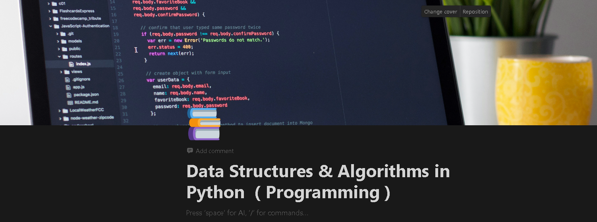

# Welcome! To 👋 DSA with Python @GrvExplorer

# My Learning

- Efficiency
- What is Algorithm
- Approximate
- Big o notation ( O(n) )
- linkedList
- Queues Stack Deques
- Algorithms
  -
  - Binary Search
  - Recursion
  - Sort Algorithm
    - Bubble Sort
    - Merge Sort
    - Quick sort
  - Maps

  ### Further Learning

  ### My Progress

  ### TODO's
  - Quicksort practice of creating function

# Acknowledgments

# Feedback for me

# Useful Resources

 - [FigJam](https://www.figma.com/file/a8G0Bfav1FrxGEM7HajGdT/DSA?type=whiteboard&node-id=0%3A1&t=Kv3ekbykZloi9qMt-1)

# Course

- [Udacity](https://learn.udacity.com/courses/ud513)
- [Visual Learning](https://csvistool.com/)

## For Developers

    ## The challenge
    ## Clone Repo
    ## Assets
    ## Figma file
    ## Share your project with me
    ## Need Help from me

**Have fun Coding 🚀**
